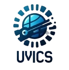

<p align="center">
  
</p>

<h1 align="center">🌐 UVICS — Unklab Virtue in Computer Science</h1>

<p align="center">
  <em>Komunitas Mahasiswa Universitas Klabat yang Berprestasi dan Berdampak</em>
</p>

<p align="center">
  <a href="https://github.com/WEBUVICS/frontend">
    
  </a>
  
  
  
  
</p>

<p align="center">
  <a href="https://www.instagram.com/uvics_id/">
    
  </a>
  <a href="https://www.linkedin.com/company/uvics-unklab-virtue-in-computer-science/">
    
  </a>
  <a href="https://github.com/WEBUVICS">
    
  </a>
</p>

---

## 📖 Deskripsi

**UVICS (Unklab Virtue in Computer Science)** adalah website resmi komunitas mahasiswa Universitas Klabat yang berfokus pada pengembangan potensi, kolaborasi, dan pencapaian prestasi di bidang teknologi dan bisnis.

Website ini dibangun sebagai **platform digital utama** UVICS untuk:

- 🏆 **Menampilkan showcase** proyek dan pencapaian anggota
- 📢 **Mempublikasikan event dan pengumuman** terkini kepada komunitas
- 👥 **Mengelola informasi department** berdasarkan sistem batch keanggotaan
- 📸 **Mendokumentasikan kegiatan** melalui galeri media dan event
- ❓ **Menyediakan FAQ interaktif** untuk menjawab pertanyaan umum calon anggota

> *"Kehidupan adalah 10% apa yang terjadi padamu dan 90% bagaimana kamu meresponsnya."*
> — Charles R. Swindoll

---

## 🛠️ Tech Stack

| Kategori | Teknologi | Versi |
|:---|:---|:---|
| ⚡ **Framework** | [Next.js](https://nextjs.org/) | `^16.2.3` |
| ⚛️ **Library UI** | [React](https://react.dev/) | `^19.1.0` |
| 🟦 **Bahasa** | [TypeScript](https://www.typescriptlang.org/) | `^5` |
| 🎨 **Styling** | [Tailwind CSS](https://tailwindcss.com/) | `^4` |
| 🎬 **Animasi** | [Framer Motion](https://www.framer.com/motion/) | `^12.23.12` |
| 🧩 **UI Primitives** | [Radix UI](https://www.radix-ui.com/) | Navigation, Dropdown, Select, Label |
| 🎠 **Carousel** | [Embla Carousel](https://www.embla-carousel.com/) | `^8.6.0` |
| 🎠 **Slider** | [Swiper](https://swiperjs.com/) | `^12.0.2` |
| 🔷 **Ikon** | [Lucide React](https://lucide.dev/) | `^0.525.0` |
| 🔧 **Utility** | class-variance-authority, clsx, tailwind-merge | — |

---

## ✨ Fitur Unggulan

| Fitur | Deskripsi |
|:---|:---|
| 🏠 **Landing Page** | Halaman utama dengan hero image, deskripsi organisasi, alasan bergabung, quotes inspiratif, dan daftar event terbaru. |
| 🏆 **Showcase** | Galeri proyek dan pencapaian anggota UVICS dengan halaman detail dinamis per proyek. |
| 🏢 **Department** | Informasi departemen berdasarkan batch keanggotaan (Batch 1, Batch 2, Batch 2.5) dengan slider interaktif. |
| 📸 **Media** | Dokumentasi event, galeri foto, dan pengumuman aktivitas komunitas dengan animasi Framer Motion. |
| ℹ️ **About** | Profil lengkap UVICS: Visi & Misi, Sejarah, Program unggulan, deskripsi divisi (Job Desc), dan benefits keanggotaan. |
| ❓ **FAQs** | Halaman FAQ interaktif dengan layout dua kolom dan accordion animasi yang responsif. |
| 📝 **Registrasi** | Tombol pendaftaran anggota baru terintegrasi langsung di halaman utama. |

### 🎨 Desain & UX

- 🎯 **Fully Responsive** — Mendukung desktop, tablet, dan mobile dengan navigasi adaptif
- ✨ **Animasi Smooth** — Hover effects, transisi halus, dan micro-interactions menggunakan Framer Motion
- 🔤 **Typography Premium** — Google Fonts: Quicksand, Open Sans, Poppins, Roboto Mono
- 🗺️ **Google Maps Embedded** — Lokasi kampus tertanam langsung di footer
- 🔗 **Social Media Terintegrasi** — Link langsung ke Instagram, LinkedIn, dan GitHub

---

## 🚀 Getting Started

### Prasyarat

Pastikan perangkat Anda sudah terinstal:

- **Node.js** `v18` atau lebih baru — [Download](https://nodejs.org/)
- **npm** `v9+` (bawaan Node.js) atau **yarn** / **pnpm**
- **Git** — [Download](https://git-scm.com/)

### Instalasi

1. **Clone repository**

   ```bash
   git clone https://github.com/WEBUVICS/frontend.git
   ```

2. **Masuk ke direktori proyek**

   ```bash
   cd frontend
   ```

3. **Instal semua dependensi**

   ```bash
   npm install
   ```

4. **Jalankan development server**

   ```bash
   npm run dev
   ```

5. **Buka di browser**

   Kunjungi [http://localhost:3000](http://localhost:3000) untuk melihat website secara lokal.

### Script Tersedia

| Perintah | Fungsi |
|:---|:---|
| `npm run dev` | Menjalankan server pengembangan lokal |
| `npm run build` | Membuat build produksi yang dioptimasi |
| `npm run start` | Menjalankan server produksi |
| `npm run lint` | Menjalankan ESLint untuk pengecekan kualitas kode |

---

## 📁 Struktur Proyek

```
frontend/
├── 📂 app/                         # Next.js App Router
│   ├── 📂 (user)/                  # Halaman publik (route group)
│   │   ├── 📄 page.tsx             # Landing page / Home
│   │   ├── 📄 layout.tsx           # Layout utama (Navbar + Footer)
│   │   ├── 📂 about/              # Halaman About (Visi, Misi, Program)
│   │   ├── 📂 showcase/           # Galeri showcase proyek
│   │   │   └── 📂 [id]/           # Detail proyek (dynamic route)
│   │   ├── 📂 department/         # Informasi batch keanggotaan
│   │   │   ├── 📂 batch1/
│   │   │   ├── 📂 batch2/
│   │   │   └── 📂 batch3/
│   │   ├── 📂 media/              # Event & dokumentasi media
│   │   └── 📂 faqs/               # Halaman FAQ interaktif
│   ├── 📂 api/                     # API Routes
│   ├── 📂 login/                   # Halaman login
│   └── 📄 globals.css              # Global stylesheet & CSS variables
│
├── 📂 components/                  # Komponen React reusable
│   ├── 📂 ui/                      # Komponen UI dasar (Radix-based)
│   │   ├── button.tsx, card.tsx, carousel.tsx
│   │   ├── dropdown-menu.tsx, input.tsx
│   │   ├── label.tsx, select.tsx
│   │   ├── navigation-menu.tsx, pagination.tsx
│   │   └── ...
│   ├── 📂 userComponents/         # Komponen sisi pengguna
│   │   ├── eventCard.tsx
│   │   ├── announcementCard.tsx
│   │   └── RegistrationButton.tsx
│   ├── 📂 showcase/               # Komponen showcase
│   │   └── showcase-cards.tsx
│   ├── 📄 navbar.tsx               # Navigasi utama (responsive)
│   ├── 📄 footer.tsx               # Footer dengan kontak & maps
│   └── 📄 CardDemo.tsx             # Demo komponen card
│
├── 📂 lib/                         # Fungsi utilitas
│   └── 📄 utils.ts                # Utility functions (cn, dll.)
│
├── 📂 style/                       # Konfigurasi font
│   └── 📄 fonts.ts                # Google Fonts setup
│
├── 📂 types/                       # TypeScript type definitions
│   ├── 📄 data-type.d.ts
│   └── 📄 global.d.ts
│
├── 📂 public/                      # Aset statis
│   ├── 📂 icon/                   # Logo & ikon
│   ├── 📂 event/                  # Gambar event
│   ├── 📂 gallery/                # Galeri foto
│   ├── 📂 member/                 # Foto anggota
│   ├── 📂 project/                # Gambar proyek showcase
│   └── 📄 favicon.png             # Favicon website
│
├── 📄 package.json                 # Dependensi & script proyek
├── 📄 tsconfig.json                # Konfigurasi TypeScript
├── 📄 next.config.ts               # Konfigurasi Next.js
├── 📄 postcss.config.mjs           # Konfigurasi PostCSS
├── 📄 eslint.config.mjs            # Konfigurasi ESLint
├── 📄 components.json              # Konfigurasi shadcn/ui
└── 📄 BRANCH.md                    # Panduan branching
```

---

## 🤝 Kontribusi

Kami sangat terbuka untuk kontribusi dari anggota UVICS maupun komunitas! Berikut langkah-langkah untuk berkontribusi:

### Langkah Kontribusi

1. **Fork** repository ini

2. **Buat branch baru** untuk fitur atau perbaikan Anda

   ```bash
   git checkout -b feature/nama-fitur
   ```

3. **Lakukan perubahan** pada kode sesuai kebutuhan

4. **Commit** dengan pesan yang deskriptif

   ```bash
   git commit -m "feat: menambahkan fitur baru untuk halaman showcase"
   ```

5. **Push** ke branch Anda

   ```bash
   git push origin feature/nama-fitur
   ```

6. **Buat Pull Request** ke branch `main` dan tunggu review dari tim

### Konvensi Commit

| Prefix | Penggunaan |
|:---|:---|
| `feat:` | Menambahkan fitur baru |
| `fix:` | Memperbaiki bug |
| `style:` | Perubahan styling/UI (tanpa mengubah logika) |
| `refactor:` | Refactoring kode tanpa mengubah fungsionalitas |
| `docs:` | Perubahan pada dokumentasi |
| `chore:` | Perubahan konfigurasi atau dependensi |

### Panduan Umum

- ✅ Pastikan kode lolos `npm run lint` sebelum membuat PR
- ✅ Gunakan **TypeScript** untuk semua file komponen baru
- ✅ Ikuti struktur folder yang sudah ada
- ✅ Tambahkan komentar pada bagian kode yang kompleks
- ✅ Pastikan website tetap **responsive** di semua ukuran layar

---

## 📜 Lisensi

Proyek ini bersifat **private** dan dikembangkan secara internal oleh tim **UVICS — Unklab Virtue in Computer Science**, Universitas Klabat.

Semua hak cipta dilindungi. Penggunaan, distribusi, atau reproduksi tanpa izin tertulis dari organisasi UVICS tidak diperkenankan.

```
Copyright © 2026 UVICS · UNKLAB Virtue in Computer Science.
All rights reserved.
```

---

## 📬 Kontak

Punya pertanyaan, saran, atau ingin berkolaborasi? Hubungi kami melalui:

<table>
  <tr>
    <td>📧 <strong>Email</strong></td>
    <td><a href="mailto:uvics@unklab.ac.id">uvics@unklab.ac.id</a></td>
  </tr>
  <tr>
    <td>📱 <strong>Telepon</strong></td>
    <td>+62 853 0943 7394</td>
  </tr>
  <tr>
    <td>📸 <strong>Instagram</strong></td>
    <td><a href="https://www.instagram.com/uvics_id/">@uvics_id</a></td>
  </tr>
  <tr>
    <td>💼 <strong>LinkedIn</strong></td>
    <td><a href="https://www.linkedin.com/company/uvics-unklab-virtue-in-computer-science/">UVICS UNKLAB</a></td>
  </tr>
  <tr>
    <td>🐙 <strong>GitHub</strong></td>
    <td><a href="https://github.com/WEBUVICS">WEBUVICS</a></td>
  </tr>
  <tr>
    <td>📍 <strong>Lokasi</strong></td>
    <td>Universitas Klabat, Airmadidi, Sulawesi Utara, Indonesia</td>
  </tr>
</table>

---

<p align="center">
  Dibuat oleh <strong>Divisi Web Development UVICS</strong>
</p>
